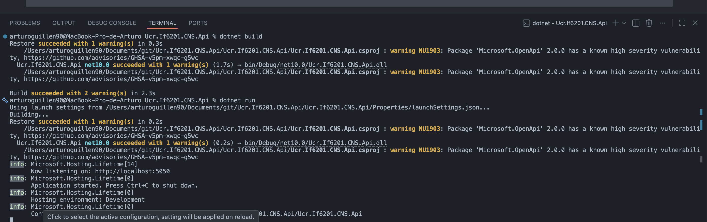

# Guía práctica: Instalación y configuración de un web API para C# y .NET 10 en Windows

**Curso**: IF-6201 Informática Aplicada a los Negocios  
**Nivel**: 3er año de Informática Empresarial  
**Framework**: .NET 10  
**Lenguaje**: C#  
**IDE/Editor**: Visual Studio Code  
**Nivel**: Intermedio  
**Modalidad**: Guía de implementación  
**Duración estimada**: 1.5 hora 

---

### Contexto de la Arquitectura de Capas
Antes de iniciar, es fundamental comprender el propósito de cada proyecto que vas a crear. En el ámbito empresarial, el código se divide en capas especializadas para garantizar el orden y el mantenimiento:
*   **`.Api` (Capa de Presentación):** Expone los endpoints (rutas HTTP) para que los clientes consuman los servicios.
*   **`.BW` (Business Core / Worker):** Orquesta los flujos de trabajo principales y la lógica de negocio de alto nivel.
*   **`.BC` (Business Components):** Contiene las validaciones de los flujos de trabajo.
*   **`.Nasa.SG` (Service Gateway):** Se encarga exclusivamente de la comunicación con servicios externos (en este caso, la API de la NASA).
*   **`.DA` (Data Access):** Capa encargada de interactuar con la base de datos o el almacenamiento persistente.
*   **`.Abstracciones`:** Contiene las interfaces (`Interfaces`) y modelos de datos comunes que permiten la comunicación desacoplada entre todas las capas.
*   **`.Test`:** Proyectos dedicados a realizar pruebas unitarias automatizadas para asegurar que el código funcione correctamente.
*   

### Ejemplos de responsabilidades de capas
#### **.Api** 
- Controladores REST
- Configuración de la aplicación
- Middleware

#### **.BW** 
- Reglas de negocio
- Servicios de aplicación

#### **.BC**
- Validaciones

#### **.DA** 
- Repositorios
- Acceso a bases de datos
- Mapeo de datos

#### **.Abstracciones**
- Interfaces y contratos
- Definiciones abstractas
- DTOs

#### **.Nasa.SG** 
- Integraciones externas

### Estructura del Proyecto

```
Ucr.If6201.CNS.Api/  (Raíz de la Solución)
│
├── 📋 CAPA DE PRESENTACIÓN (HTTP/REST)
│   └── Ucr.If6201.CNS.Api                 # 🔵 API REST
│       (Expone endpoints HTTP)
│       Depende de: BW, Abstracciones
│
├── 📊 CAPA DE LÓGICA DE NEGOCIO - ORQUESTACIÓN
│   └── Ucr.If6201.CNS.BW                  # 🟡 Business Worker
│       (Orquesta flujos de trabajo)
│       Depende de: BC, DA, Nasa.SG, Abstracciones
│
├── 📊 CAPA DE LÓGICA DE NEGOCIO - VALIDACIÓN
│   └── Ucr.If6201.CNS.BC                  # 🟢 Business Components
│       (Validaciones de negocio)
│       Depende de: Abstracciones
│
├── 💾 CAPA DE ACCESO A DATOS
│   └── Ucr.If6201.CNS.DA                  # 🟠 Data Access
│       (Repositorios e interacción con BD)
│       Depende de: Abstracciones
│
├── 🌐 INTEGRACIONES EXTERNAS
│   └── Ucr.If6201.CNS.Nasa.SG             # 🔴 Service Gateway
│       (Comunicación con APIs externas)
│       Depende de: Abstracciones
│
├── 🔗 ABSTRACCIONES Y CONTRATOS
│   └── Ucr.If6201.CNS.Abstracciones  # 🟣 Abstracciones
│       (Interfaces, DTOs, contratos)
│       Consumida por: Api, BW, BC, DA, Nasa.SG
│
├── 🧪 PROYECTOS DE PRUEBAS UNITARIAS
│   ├── Ucr.If6201.CNS.BW.Test             # Tests para BW
│       Depende de: BW, Abstracciones
│   │
│   └── Ucr.If6201.CNS.BC.Test             # Tests para BC
│       Depende de: BC, Abstracciones
│
├── 📚 DOCUMENTACIÓN
│   └── docs/                              # Archivos de documentación
│
└── 📦 ARCHIVOS RAÍZ
    ├── Ucr.If6201.CNS.Api.slnx            # Archivo de solución
    ├── .gitignore                         # Exclusiones de Git
    └── README.md                          # Información general
```

### Mapa de Dependencias entre Capas

```
    ┌──────────────────────────────┐
    │  .Api                        │
    │  (Capa de Presentación)      │
    └────────────┬─────────────────┘
                 │ Consume
                 ▼
    ┌──────────────────────────────┐
    │  .BW                         │
    │  (Orquestador)               │
    └──┬────────────┬────────┬─────┘
       │            │        │ Consume
       │ Consume    │        ▼
       ▼            │    ┌───────────────┐
    ┌───────────┐   │    │  .Nasa.SG     │
    │  .BC      │   │    │  (Gateway)    │
    │(Validar)  │   │    └───┬───────────┘
    └───┬───────┘   │        │
        │           ▼        │
        │       ┌────────┐   │
        │       │  .DA   │   │
        │       │ (BD)   │   │
        │       └────┬───┘   │
        │            │       │
        └────────┬───┴───┬───┘
                 │       │
                 ▼       ▼
    ┌──────────────────────────────┐
    │  .Abstracciones              │
    │  (Interfaces y Contratos)    │
    └──────────────────────────────┘
```

---

## 1. Crear la carpeta principal de la solución y acceder a ella
```powershell
mkdir Ucr.If6201.CNS.Api
cd Ucr.If6201.CNS.Api
```

## 2. Crear el archivo de solución (.sln) con el nombre requerido
```powershell
dotnet new slnx -n Ucr.If6201.CNS.Api
```

## 3. Crear el proyecto Web API usando controladores tradicionales
```powershell
dotnet new webapi -n Ucr.If6201.CNS.Api --framework net10.0 --use-controllers
```

## 4. Crear los proyectos de tipo Biblioteca de Clases (Class Library)
```powershell
dotnet new classlib -n Ucr.If6201.CNS.BW --framework net10.0
dotnet new classlib -n Ucr.If6201.CNS.BC --framework net10.0
dotnet new classlib -n Ucr.If6201.CNS.Nasa.SG --framework net10.0
dotnet new classlib -n Ucr.If6201.CNS.Abstracciones --framework net10.0
dotnet new classlib -n Ucr.If6201.CNS.DA --framework net10.0
```

## 5. Crear los proyectos de pruebas unitarias con la plantilla de MSTest
```powershell
dotnet new mstest -n Ucr.If6201.CNS.BW.Test --framework net10.0
dotnet new mstest -n Ucr.If6201.CNS.BC.Test --framework net10.0
```

## 6. Vincular todos los proyectos creados a la solución principal
```powershell
dotnet sln add Ucr.If6201.CNS.Api/Ucr.If6201.CNS.Api.csproj
dotnet sln add Ucr.If6201.CNS.BW/Ucr.If6201.CNS.BW.csproj
dotnet sln add Ucr.If6201.CNS.BC/Ucr.If6201.CNS.BC.csproj
dotnet sln add Ucr.If6201.CNS.Nasa.SG/Ucr.If6201.CNS.Nasa.SG.csproj
dotnet sln add Ucr.If6201.CNS.Abstracciones/Ucr.If6201.CNS.Abstracciones.csproj
dotnet sln add Ucr.If6201.CNS.DA/Ucr.If6201.CNS.DA.csproj
dotnet sln add Ucr.If6201.CNS.BW.Test/Ucr.If6201.CNS.BW.Test.csproj
dotnet sln add Ucr.If6201.CNS.BC.Test/Ucr.If6201.CNS.BC.Test.csproj
```

## 7. Configurar las Referencias entre Proyectos (Interconexión de Capas)
Para que los proyectos puedan comunicarse entre sí y consumir sus clases o interfaces, debes establecer las referencias jerárquicas ejecutando los siguientes comandos desde la raíz de la solución:

```powershell
# 7.1. El API necesita conocer la lógica de negocio (BW) y las Abstracciones
dotnet add Ucr.If6201.CNS.Api/Ucr.If6201.CNS.Api.csproj reference Ucr.If6201.CNS.BW/Ucr.If6201.CNS.BW.csproj 
dotnet add Ucr.If6201.CNS.Api/Ucr.If6201.CNS.Api.csproj reference Ucr.If6201.CNS.Abstracciones/Ucr.If6201.CNS.Abstracciones.csproj

# 7.2. La lógica principal (BW) coordina los componentes (BC), el acceso a datos (DA), las Abstracciones y gateway externo (Nasa.SG)
dotnet add Ucr.If6201.CNS.BW/Ucr.If6201.CNS.BW.csproj reference Ucr.If6201.CNS.BC/Ucr.If6201.CNS.BC.csproj 
dotnet add Ucr.If6201.CNS.BW/Ucr.If6201.CNS.BW.csproj reference Ucr.If6201.CNS.DA/Ucr.If6201.CNS.DA.csproj 
dotnet add Ucr.If6201.CNS.BW/Ucr.If6201.CNS.BW.csproj reference Ucr.If6201.CNS.Abstracciones/Ucr.If6201.CNS.Abstracciones.csproj
dotnet add Ucr.If6201.CNS.BW/Ucr.If6201.CNS.BW.csproj reference Ucr.If6201.CNS.Nasa.SG/Ucr.If6201.CNS.Nasa.SG.csproj

# 7.3. Los Componentes de Negocio (BC) las Abstracciones
dotnet add Ucr.If6201.CNS.BC/Ucr.If6201.CNS.BC.csproj reference Ucr.If6201.CNS.Abstracciones/Ucr.If6201.CNS.Abstracciones.csproj

# 7.4. El Acceso a Datos (DA) implementan los contratos de las Abstracciones
dotnet add Ucr.If6201.CNS.DA/Ucr.If6201.CNS.DA.csproj reference Ucr.If6201.CNS.Abstracciones/Ucr.If6201.CNS.Abstracciones.csproj

# 7.5. El Gateway de la NASA implementan los contratos de las Abstracciones
dotnet add Ucr.If6201.CNS.Nasa.SG/Ucr.If6201.CNS.Nasa.SG.csproj reference Ucr.If6201.CNS.Abstracciones/Ucr.If6201.CNS.Abstracciones.csproj

# 7.5. Los proyectos de pruebas necesitan referenciar a las capas que van a testear (BW)(BC) y las Abstracciones
dotnet add Ucr.If6201.CNS.BW.Test/Ucr.If6201.CNS.BW.Test.csproj reference Ucr.If6201.CNS.BW/Ucr.If6201.CNS.BW.csproj
dotnet add Ucr.If6201.CNS.BW.Test/Ucr.If6201.CNS.BW.Test.csproj reference Ucr.If6201.CNS.Abstracciones/Ucr.If6201.CNS.Abstracciones.csproj

dotnet add Ucr.If6201.CNS.BC.Test/Ucr.If6201.CNS.BC.Test.csproj reference Ucr.If6201.CNS.BC/Ucr.If6201.CNS.BC.csproj
dotnet add Ucr.If6201.CNS.BC.Test/Ucr.If6201.CNS.BC.Test.csproj reference Ucr.If6201.CNS.Abstracciones/Ucr.If6201.CNS.Abstracciones.csproj

```

## 8. Agregar el paquete NuGet para la interfaz gráfica interactiva de Scalar al proyecto Web API
```powershell
# Asegúrarse de posicionarse en la carpeta del proyecto Web API (`Ucr.If6201.CNS.Api` donde estan los archvios controllers).
cd Ucr.If6201.CNS.Api
dotnet add package Scalar.AspNetCore --version 2.17.1
```

## 9. Configurar Scalar en el archivo Program.cs
Abre el archivo `Program.cs` dentro de la carpeta del API e integra la referencia `using Scalar.AspNetCore;` junto con la línea `app.MapScalarApiReference();` dentro del bloque de desarrollo.

```c#
using Scalar.AspNetCore;

var builder = WebApplication.CreateBuilder(args);

// Add services to the container.
builder.Services.AddControllers();

// Configuración nativa de OpenAPI en .NET 10
builder.Services.AddOpenApi();

var app = builder.Build();

// Configure the HTTP request pipeline.
if (app.Environment.IsDevelopment())
{
    app.MapOpenApi();
    app.MapScalarApiReference(); // Scalar UI para documentación interactiva del API
}

app.UseHttpsRedirection();
app.UseAuthorization();
app.MapControllers();

app.Run();
```
Recordar al final guardar los cambios en el archivo `Program.cs` con comando de teclado `Ctrl + s`.

## 10. Compilar y ejecutar el programa con recarga en vivo (Hot Reload)
Para evitar tener que apagar y encender la consola cada vez que realices modificaciones en los controladores o clases, ejecutaremos la aplicación en modo observador (*watch*). Asegúrarse de seguir posicionado en la carpeta del proyecto Web API (`Ucr.If6201.CNS.Api`).

```powershell
dotnet build
dotnet watch
```

## 11. Visualizar la documentación del API en el navegador web
Revisa las líneas de salida impresas en la consola de Visual Studio Code. Verás que Kestrel (el servidor interno de .NET) asigna puertos aleatorios por seguridad y rendimiento en desarrollo.

1. Identifica la URL local provista por la consola (se verá similar a `https://localhost:7000` o `http://localhost:5000`).
2. Copia esa dirección y ábrela en tu navegador preferido (Firefox, Chrome, Edge, etc.).
3. Añade el segmento `/scalar` al final de la ruta en la barra de direcciones.

> **Ejemplo de URL final:** `https://localhost:7000/scalar`

Ver imagen de ejemplo:

